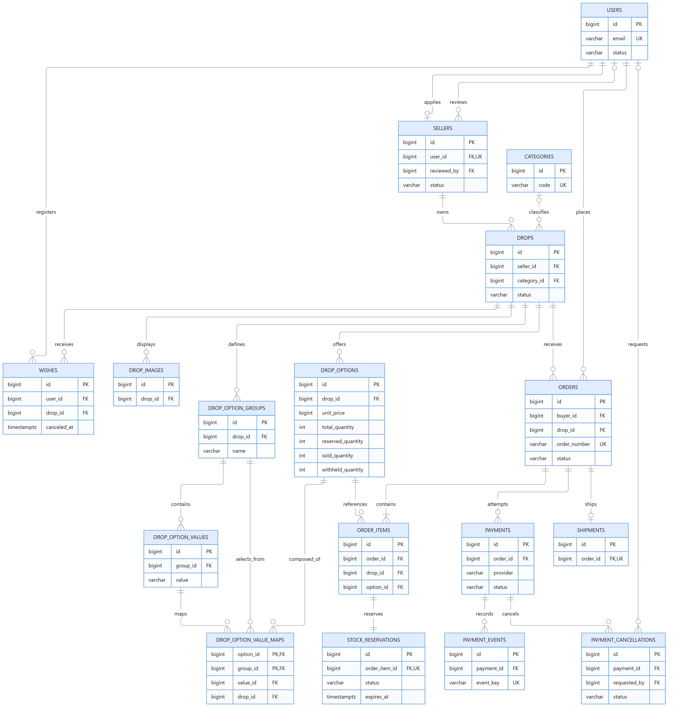

# GRAB ERD



> 위 이미지는 핵심 업무 관계를 요약한 개념도이며, 공통 시각 컬럼과 Refresh Token 등 인증 보조 테이블은 아래 테이블 정의를 기준으로 한다.

## 0. 공통 규칙

- 주요 업무 테이블은 `created_at`, `updated_at`을 `TIMESTAMPTZ`로 가진다.
- 판매 가능 여부, 예약 만료 및 상태 전이는 서버 시각을 기준으로 판단한다.
- API가 반환하는 `SELLER` 권한은 별도 회원 역할 컬럼이 아니라 `sellers.status = APPROVED`에서 파생한다.
- 알림 기능은 MVP 범위에서 제외하며 알림 테이블을 생성하지 않는다.

## 1. 테이블 정의

### 1.1 회원 및 판매자

#### `users`

| 컬럼 | 타입 | 필수 | 설명 |
| --- | --- | --- | --- |
| `id` | BIGINT | O | PK |
| `email` | VARCHAR(254) | O | UQ, 정규화 후 저장 |
| `password_hash` | VARCHAR(255) | 조건부 | LOCAL 회원만 필수 |
| `display_name` | VARCHAR(100) | O | 표시 이름 |
| `phone` | VARCHAR(30) | O | 회원 연락처 |
| `profile_image_url` | VARCHAR(500) | X | 이미지 객체 키 또는 영속 URL |
| `role` | VARCHAR(20) | O | `USER`, `ADMIN` |
| `status` | VARCHAR(20) | O | `ACTIVE`, `SUSPENDED`, `WITHDRAWN` |
| `provider` | VARCHAR(20) | O | `LOCAL`, `KAKAO`, `GOOGLE` |

판매자는 회원의 배타적인 역할이 아니다. `sellers.status = APPROVED`인 회원에게 판매자 기능을 허용한다.

MVP 회원가입은 `LOCAL` 방식만 제공한다. `KAKAO`, `GOOGLE` 값은 소셜 로그인을 도입할 때 사용한다.

#### `refresh_tokens`

| 컬럼 | 타입 | 필수 | 설명 |
| --- | --- | --- | --- |
| `id` | BIGINT | O | PK |
| `user_id` | BIGINT | O | FK users |
| `token_hash` | VARCHAR(255) | O | 원문 대신 해시 저장, UQ |
| `expires_at` | TIMESTAMPTZ | O | 만료 시각 |
| `revoked_at` | TIMESTAMPTZ | X | 로그아웃·재발급으로 무효화된 시각 |

Access Token은 짧게 유지하고 Refresh Token은 재발급 시 교체한다. 로그아웃 시 해당 Refresh Token을 폐기한다.

#### `sellers`

| 컬럼 | 타입 | 필수 | 설명 |
| --- | --- | --- | --- |
| `id` | BIGINT | O | PK |
| `user_id` | BIGINT | O | FK users, UQ |
| `brand_name` | VARCHAR(100) | O | 브랜드명 |
| `contact_email` | VARCHAR(254) | O | 판매자 연락 이메일 |
| `description` | TEXT | X | 브랜드 소개 |
| `status` | VARCHAR(20) | O | `PENDING`, `APPROVED`, `REJECTED` |
| `submitted_at` | TIMESTAMPTZ | O | 신청 시각 |
| `reviewed_by` | BIGINT | X | FK users, 관리자 심사자 |
| `reviewed_at` | TIMESTAMPTZ | X | 심사 시각 |
| `rejection_reason` | TEXT | X | 반려 시 필수 |

MVP에서는 판매자 신청과 프로필을 한 테이블에서 관리한다. 신청 이력 보존이 필요해지면 `seller_applications`를 별도 분리한다.

### 1.2 DROP 및 옵션

#### `categories`

| 컬럼 | 타입 | 필수 | 설명 |
| --- | --- | --- | --- |
| `id` | BIGINT | O | PK |
| `code` | VARCHAR(50) | O | UQ, 변경하지 않는 식별 코드 |
| `name` | VARCHAR(100) | O | 표시명 |
| `is_active` | BOOLEAN | O | 기본 `true` |

#### `drops`

| 컬럼 | 타입 | 필수 | 설명 |
| --- | --- | --- | --- |
| `id` | BIGINT | O | PK |
| `seller_id` | BIGINT | O | FK sellers |
| `category_id` | BIGINT | 조건부 | FK categories, 공개 시 필수 |
| `status` | VARCHAR(20) | O | `DRAFT`, `WISH`, `GRAB`, `ENDED`, `CANCELED` |
| `name` | VARCHAR(200) | 조건부 | 공개 시 필수 |
| `description` | TEXT | 조건부 | 공개 시 필수 |
| `shipping_fee` | BIGINT | 조건부 | 공개 시 필수, 0 이상 |
| `shipping_notice` | TEXT | 조건부 | 공개 시 필수 |
| `sale_starts_at` | TIMESTAMPTZ | 조건부 | 공개 시 필수 |
| `sale_ends_at` | TIMESTAMPTZ | 조건부 | 공개 시 필수 |
| `published_at` | TIMESTAMPTZ | X | 최초 공개 시각 |
| `grab_started_at` | TIMESTAMPTZ | X | 실제 GRAB 시작 시각 |
| `closed_at` | TIMESTAMPTZ | X | 종료 시각 |
| `close_reason` | VARCHAR(30) | X | `TIME_EXPIRED`, `SOLD_OUT`, `SELLER_CANCELED` |

가격은 실제 구매 단위인 `drop_options.unit_price`에서 관리한다. DROP 목록의 대표 가격은 활성 옵션의 최저가로 계산한다.

공개 시 다음 조건을 검증한다.

- 상품명, 설명, 카테고리, 일정, 배송 정보 입력
- 이미지와 구매 옵션 각각 한 개 이상 존재
- 전체 판매 수량이 1개 이상
- `sale_starts_at < sale_ends_at`

#### `drop_images`

| 컬럼 | 타입 | 필수 | 설명 |
| --- | --- | --- | --- |
| `id` | BIGINT | O | PK |
| `drop_id` | BIGINT | O | FK drops |
| `image_url` | VARCHAR(500) | O | 객체 키 또는 영속 URL |
| `sort_order` | INT | O | 0 이상, UQ(drop_id, sort_order) |
| `alt_text` | VARCHAR(300) | O | 대체 설명 |

#### `drop_option_groups`

판매자가 상품 특성에 맞게 자유롭게 정의하는 옵션 축이다. 그룹명은 색상·사이즈 등으로 고정하지 않는다.

| 컬럼 | 타입 | 필수 | 설명 |
| --- | --- | --- | --- |
| `id` | BIGINT | O | PK |
| `drop_id` | BIGINT | O | FK drops |
| `name` | VARCHAR(100) | O | 예: 색상, 사이즈 |
| `sort_order` | INT | O | 표시 순서 |

UQ(`drop_id`, `name`)를 둔다.

#### `drop_option_values`

판매자가 각 옵션 그룹에 자유롭게 추가하는 선택값이다.

| 컬럼 | 타입 | 필수 | 설명 |
| --- | --- | --- | --- |
| `id` | BIGINT | O | PK |
| `group_id` | BIGINT | O | FK drop_option_groups |
| `value` | VARCHAR(100) | O | 예: 블랙, M |
| `sort_order` | INT | O | 표시 순서 |

UQ(`group_id`, `value`)를 둔다.

#### `drop_options`

실제로 구매하고 재고를 관리하는 옵션 조합(SKU)이다. 예를 들어 판매자가 `소재`, `길이` 그룹을 만들었다면 `코튼 / 롱`이 하나의 행이다.

| 컬럼 | 타입 | 필수 | 설명 |
| --- | --- | --- | --- |
| `id` | BIGINT | O | PK |
| `drop_id` | BIGINT | O | FK drops |
| `unit_price` | BIGINT | O | 옵션 판매 가격, 0 이상 |
| `total_quantity` | INT | O | 최초 배정 수량 |
| `reserved_quantity` | INT | O | 결제 대기 중 선점 수량 |
| `sold_quantity` | INT | O | 결제가 확정된 수량 |
| `withheld_quantity` | INT | O | 반환 후 재판매를 보류한 수량 |
| `is_active` | BOOLEAN | O | 신규 주문 허용 여부 |
| `sort_order` | INT | O | 표시 순서 |

가용 재고는 저장하지 않고 다음 식으로 계산한다.

```text
available_quantity
= total_quantity - reserved_quantity - sold_quantity - withheld_quantity
```

모든 수량은 0 이상이며, 차감 수량의 합은 `total_quantity`를 초과할 수 없다.

#### `drop_option_value_maps`

| 컬럼 | 타입 | 필수 | 설명 |
| --- | --- | --- | --- |
| `option_id` | BIGINT | O | FK drop_options, PK 일부 |
| `group_id` | BIGINT | O | FK drop_option_groups, PK 일부 |
| `value_id` | BIGINT | O | FK drop_option_values |
| `drop_id` | BIGINT | O | 동일 DROP 강제용 |

PK(`option_id`, `group_id`)로 옵션 조합에서 그룹별 값을 하나만 선택하게 한다. 옵션 없는 상품도 재고 관리를 위해 값 매핑이 없는 `기본` 옵션 행 하나를 생성한다.

애플리케이션은 공개 전에 각 SKU가 모든 옵션 그룹에서 정확히 한 값을 선택했는지, 동일한 값 조합의 SKU가 중복되지 않는지 검증한다.

### 1.3 WISH

#### `wishes`

| 컬럼 | 타입 | 필수 | 설명 |
| --- | --- | --- | --- |
| `id` | BIGINT | O | PK |
| `user_id` | BIGINT | O | FK users |
| `drop_id` | BIGINT | O | FK drops |
| `activated_at` | TIMESTAMPTZ | O | 최근 등록 시각 |
| `canceled_at` | TIMESTAMPTZ | X | NULL이면 활성 |

UQ(`user_id`, `drop_id`)를 둔다. 취소 후 재등록은 기존 행을 다시 활성화하며, GRAB 시작 이후에는 등록과 취소를 모두 제한한다.

### 1.4 주문 및 재고 예약

#### `orders`

| 컬럼 | 타입 | 필수 | 설명 |
| --- | --- | --- | --- |
| `id` | BIGINT | O | PK |
| `order_number` | VARCHAR(64) | O | UQ, 사용자와 PG에 전달하는 주문번호 |
| `buyer_id` | BIGINT | O | FK users |
| `drop_id` | BIGINT | O | FK drops, 주문당 DROP 하나 |
| `idempotency_key` | VARCHAR(100) | O | UQ(buyer_id, idempotency_key) |
| `request_hash` | VARCHAR(64) | O | 같은 키의 다른 요청 탐지 |
| `status` | VARCHAR(30) | O | 주문 상태 |
| `product_name_snapshot` | VARCHAR(200) | O | 주문 당시 상품명 |
| `seller_name_snapshot` | VARCHAR(100) | O | 주문 당시 판매자명 |
| `items_amount` | BIGINT | O | 상품 합계 |
| `shipping_amount` | BIGINT | O | 배송비 |
| `total_amount` | BIGINT | O | `items_amount + shipping_amount` |
| `recipient_name` | VARCHAR(100) | O | 수령인 |
| `recipient_phone` | VARCHAR(30) | O | 배송 연락처 |
| `postal_code` | VARCHAR(20) | O | 우편번호 |
| `address_line1` | VARCHAR(300) | O | 기본 주소 |
| `address_line2` | VARCHAR(300) | X | 상세 주소 |
| `delivery_memo` | VARCHAR(300) | X | 배송 요청사항 |
| `payment_expires_at` | TIMESTAMPTZ | O | 결제 마감 시각 |
| `paid_at` | TIMESTAMPTZ | X | 결제 확정 시각 |
| `canceled_at` | TIMESTAMPTZ | X | 주문 취소 시각 |

배송지와 상품 정보는 주문 시점의 값을 보존한다. 로그에는 주소와 전화번호 원문을 남기지 않는다.

#### `order_items`

| 컬럼 | 타입 | 필수 | 설명 |
| --- | --- | --- | --- |
| `id` | BIGINT | O | PK |
| `order_id` | BIGINT | O | FK orders |
| `drop_id` | BIGINT | O | 동일 DROP 강제용 |
| `option_id` | BIGINT | O | FK drop_options |
| `option_name_snapshot` | VARCHAR(200) | O | 주문 당시 옵션명 |
| `unit_price` | BIGINT | O | 주문 당시 옵션 단가 |
| `quantity` | INT | O | 1 이상 |

UQ(`order_id`, `option_id`)를 둔다. `drop_id`를 포함한 복합 FK로 다른 DROP의 옵션이 주문에 섞이지 않도록 한다.

#### `stock_reservations`

| 컬럼 | 타입 | 필수 | 설명 |
| --- | --- | --- | --- |
| `id` | BIGINT | O | PK |
| `order_item_id` | BIGINT | O | FK order_items, UQ |
| `status` | VARCHAR(20) | O | `HELD`, `COMMITTED`, `RELEASED` |
| `expires_at` | TIMESTAMPTZ | O | 결제 대기 만료 시각 |
| `committed_at` | TIMESTAMPTZ | X | 판매 확정 시각 |
| `released_at` | TIMESTAMPTZ | X | 반환 시각 |
| `release_reason` | VARCHAR(30) | X | `PAYMENT_FAILED`, `EXPIRED`, `ORDER_CANCELED` |
| `release_destination` | VARCHAR(20) | X | `AVAILABLE`, `WITHHELD` |

예약 수량과 옵션은 변경 불가능한 `order_items`에서 조회한다. 반환한 예약 행은 삭제하거나 재사용하지 않는다.

#### `order_cancellation_requests`

결제 전 주문 취소를 포함한 취소 API의 멱등 요청을 기록한다.

| 컬럼 | 타입 | 필수 | 설명 |
| --- | --- | --- | --- |
| `id` | BIGINT | O | PK |
| `order_id` | BIGINT | O | FK orders |
| `buyer_id` | BIGINT | O | FK users |
| `idempotency_key` | VARCHAR(100) | O | UQ(buyer_id, idempotency_key) |
| `request_hash` | VARCHAR(64) | O | 같은 키의 다른 요청 탐지 |
| `reason` | VARCHAR(300) | O | 취소 사유 |

### 1.5 결제 및 취소

#### `payments`

| 컬럼 | 타입 | 필수 | 설명 |
| --- | --- | --- | --- |
| `id` | BIGINT | O | PK |
| `order_id` | BIGINT | O | FK orders, 주문당 여러 결제 시도 가능 |
| `provider` | VARCHAR(30) | O | `MOCK`, `TOSS` |
| `idempotency_key` | VARCHAR(100) | O | UQ(provider, idempotency_key) |
| `request_hash` | VARCHAR(64) | O | 같은 키의 다른 요청 탐지 |
| `provider_payment_id` | VARCHAR(200) | X | PG 결제 식별자 |
| `amount` | BIGINT | O | 승인 요청 금액 |
| `status` | VARCHAR(30) | O | `PENDING`, `SUCCEEDED`, `FAILED`, `UNKNOWN`, `CANCELED` |
| `reconciliation_status` | VARCHAR(20) | O | `NONE`, `REQUIRED`, `RESOLVED` |
| `reconciliation_reason` | TEXT | X | 지연 승인·응답 유실 등 보정 사유 |
| `approved_at` | TIMESTAMPTZ | X | 승인 확인 시각 |
| `canceled_at` | TIMESTAMPTZ | X | 전체 취소 확인 시각 |
| `failure_code` | VARCHAR(100) | X | PG 실패 코드 |
| `failure_message` | TEXT | X | 민감정보를 제거한 실패 내용 |

개별 결제 시도가 실패해도 주문은 결제 마감 전까지 `PAYMENT_PENDING`을 유지할 수 있다. 주문은 결제 성공, 사용자 취소 또는 만료 시 최종 상태로 전환한다.

#### `payment_events`

| 컬럼 | 타입 | 필수 | 설명 |
| --- | --- | --- | --- |
| `id` | BIGINT | O | PK |
| `payment_id` | BIGINT | O | FK payments |
| `event_key` | VARCHAR(200) | O | UQ(payment_id, event_key) |
| `event_type` | VARCHAR(40) | O | 승인·실패·취소·조회 이벤트 |
| `source` | VARCHAR(20) | O | `API`, `WEBHOOK`, `RECONCILIATION` |
| `processing_result` | VARCHAR(30) | O | `APPLIED`, `REJECTED`, `RECONCILIATION_REQUIRED` |
| `payload` | JSONB | O | 민감정보를 제거한 허용 필드만 저장 |
| `occurred_at` | TIMESTAMPTZ | X | 외부 시스템 발생 시각 |

#### `payment_cancellations`

| 컬럼 | 타입 | 필수 | 설명 |
| --- | --- | --- | --- |
| `id` | BIGINT | O | PK |
| `payment_id` | BIGINT | O | FK payments |
| `requested_by` | BIGINT | X | FK users, 시스템 보정은 NULL |
| `purpose` | VARCHAR(30) | O | `ORDER_CANCEL`, `LATE_APPROVAL_COMPENSATION` |
| `idempotency_key` | VARCHAR(100) | O | UQ |
| `request_hash` | VARCHAR(64) | O | 같은 키의 다른 요청 탐지 |
| `amount` | BIGINT | O | MVP는 전액 취소만 지원 |
| `reason` | TEXT | O | 취소 사유 |
| `status` | VARCHAR(20) | O | `REQUESTED`, `UNKNOWN`, `SUCCEEDED`, `FAILED` |
| `provider_cancel_id` | VARCHAR(200) | X | PG 취소 식별자 |
| `completed_at` | TIMESTAMPTZ | X | 처리 완료 시각 |
| `failure_code` | VARCHAR(100) | X | 실패 코드 |
| `attempt_count` | INT | O | 통신 재시도 횟수 |
| `next_retry_at` | TIMESTAMPTZ | X | 재조회·재시도 시각 |

### 1.6 배송

#### `shipments`

| 컬럼 | 타입 | 필수 | 설명 |
| --- | --- | --- | --- |
| `id` | BIGINT | O | PK |
| `order_id` | BIGINT | O | FK orders, UQ |
| `idempotency_key` | VARCHAR(100) | O | UQ, 배송 등록 요청 멱등 키 |
| `request_hash` | VARCHAR(64) | O | 같은 키의 다른 요청 탐지 |
| `carrier_code` | VARCHAR(50) | O | 택배사 코드 |
| `tracking_number` | VARCHAR(100) | O | 송장번호 |
| `shipped_at` | TIMESTAMPTZ | X | 출고 시각 |
| `delivered_at` | TIMESTAMPTZ | X | 배송 완료 시각 |

MVP는 주문당 배송 한 건만 지원하며 배송 상태는 `orders.status`에서 관리한다.

## 2. 상태 전이

### DROP

```text
DRAFT → WISH → GRAB → ENDED
   └───────────────→ CANCELED
```

### 주문

```text
PAYMENT_PENDING → PAID → PREPARING → SHIPPED → DELIVERED
       ├────────→ EXPIRED
       └────────→ CANCELED

PAID → CANCELED
```

결제 시도 실패는 `payments.status = FAILED`로 기록한다. 결제 마감 전 재시도를 허용하므로 개별 실패만으로 주문을 `PAYMENT_FAILED`로 종료하지 않는다.

### 재고 예약

```text
HELD → COMMITTED
HELD → RELEASED
COMMITTED → RELEASED
```

`COMMITTED → RELEASED`는 결제 후 주문 취소 시에만 허용한다.

## 3. 핵심 트랜잭션 규칙

### 3.1 주문 생성과 재고 선점

1. `buyer_id + idempotency_key`로 기존 주문을 확인한다.
2. 같은 키와 같은 `request_hash`이면 기존 주문을 반환한다.
3. DROP의 상태와 판매 시간을 서버 시각으로 검증한다.
4. 요청 옵션을 ID 순서로 잠근다.
5. 가용 재고를 검사하고 `reserved_quantity`를 증가시킨다.
6. 주문, 주문 항목, `HELD` 예약을 한 트랜잭션에서 생성한다.
7. 옵션 하나라도 부족하면 전체 작업을 롤백한다.

### 3.2 결제 처리

외부 PG 호출 중에는 DB 트랜잭션과 재고 잠금을 유지하지 않는다.

```text
[트랜잭션 1]
결제 시도 PENDING 생성
        ↓
[트랜잭션 없음]
외부 PG 승인 API 호출
        ↓
[트랜잭션 2]
결제·주문·예약·재고 상태 반영
```

- 성공: 주문 `PAID`, 예약 `COMMITTED`, reserved 감소, sold 증가
- 확정 실패: 결제 시도 `FAILED`; 주문은 정책에 따라 재시도 또는 만료 대기
- 통신 결과 불명: 결제 `UNKNOWN`, 보정 `REQUIRED`; PG 조회 전 실패로 단정하지 않음
- 만료: 주문 `EXPIRED`, 예약 `RELEASED`, reserved 감소

결제 성공과 만료 처리는 같은 주문 행을 잠가 한 경로만 재고를 변경하도록 한다.

### 3.3 주문 취소

- `PAYMENT_PENDING`: PG 호출 없이 예약을 해제하고 주문을 취소한다.
- `PAID`: PG 취소 성공을 확인한 후 주문과 결제를 취소하고 sold를 감소시킨다.
- `PREPARING` 이후: MVP에서는 소비자의 직접 취소를 제한한다.
- 취소 응답이 불명확하면 `UNKNOWN`으로 두고 배송 준비 전환을 막는다.

PG 취소 성공과 재고 반환은 같은 DB 트랜잭션에서 반영한다. 이미 반환된 예약에는 다시 수량을 더하지 않는다.

## 4. 우선 인덱스

PK와 UQ에서 자동 생성되는 인덱스는 중복 생성하지 않는다.

| 테이블 | 인덱스 | 용도 |
| --- | --- | --- |
| `refresh_tokens` | (`user_id`, `revoked_at`, `expires_at`) | 사용자별 유효 Refresh Token 조회 |
| `sellers` | (`status`, `submitted_at`, `id`) | 판매자 신청 심사 |
| `drops` | (`status`, `category_id`, `published_at`, `id`) | 공개 DROP 목록 |
| `drops` | (`seller_id`, `status`, `id`) | 판매자 DROP 관리 |
| `drops` | (`status`, `sale_starts_at`), (`status`, `sale_ends_at`) | 판매 시작·종료 배치 |
| `drop_options` | (`drop_id`, `is_active`, `id`) | 옵션 및 재고 조회 |
| `wishes` | (`drop_id`, `canceled_at`, `id`) | 활성 WISH 조회·집계 |
| `wishes` | (`user_id`, `activated_at`, `id`) | 소비자 마이페이지 |
| `orders` | (`buyer_id`, `created_at`, `id`) | 소비자 주문 목록 |
| `orders` | (`drop_id`, `status`, `id`) | 판매자 주문 목록 |
| `orders` | (`status`, `payment_expires_at`, `id`) | 결제 만료 처리 |
| `payments` | (`order_id`, `created_at`, `id`) | 결제 시도 이력 |
| `payments` | (`reconciliation_status`, `updated_at`, `id`) | 결제 보정 작업 |
| `payment_cancellations` | (`status`, `next_retry_at`, `id`) | 취소 재시도 |

인덱스는 실제 조회 쿼리와 실행 계획을 확인한 후 조정한다.

## 5. 구현 전 확정할 정책

| 항목 | 현재 초안 | 확정할 내용 |
| --- | --- | --- |
| 판매자 신청 정보 | 브랜드명·연락 이메일 | 사업자 정보와 증빙 필수 여부 |
| 결제 대기 시간 | 주문 생성 시점부터 10분 | 확정 |
| 결제 재시도 | 결제 마감 전 허용 | 최대 횟수 또는 제한 없음 여부 |
| 판매 종료 후 결제 | 선점 주문은 결제 마감까지 허용 | 최종 허용 여부 |
| 구매 제한 | 재고 범위만 검증 | 주문별·회원 누적 제한 |
| 주문 취소 | `PAYMENT_PENDING`, `PAID`에서 허용 | `PREPARING`부터 소비자 직접 취소 제한 |
| 취소 재고 | `AVAILABLE` | 취소·만료 재고는 즉시 가용 재고로 반환 |
| 배송비 | DROP별 고정 배송비 | 무료배송·지역 추가금 정책 |
| GRAB 중 수정 | 가격·옵션·재고 구조 변경 금지 | 설명·이미지·배송 안내 수정 범위 |
| 개인정보 | 주문 배송지 스냅샷 저장 | 보존 기간·암호화·익명화 정책 |

정책이 확정되면 이 문서와 API 명세, 상태 전이 테스트를 함께 갱신한다.
