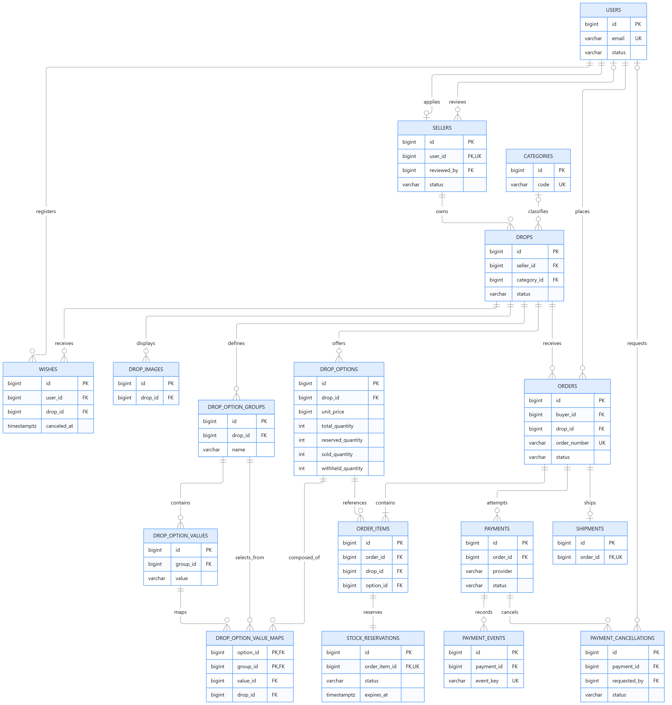

# GRAB ERD



> 위 이미지는 핵심 업무 관계를 요약한 개념도이며, 공통 시각 컬럼은 아래 테이블 정의를 기준으로 한다.

## 0. 공통 규칙

- 주요 업무 테이블은 `created_at`, `updated_at`을 `TIMESTAMPTZ`로 가진다.
- 판매 가능 여부, 예약 만료 및 상태 전이는 서버 시각을 기준으로 판단한다.
- API가 반환하는 `SELLER` 권한은 별도 회원 역할 컬럼이 아니라 `sellers.status = APPROVED`에서 파생한다.
- 알림 기능은 MVP 범위에서 제외하며 알림 테이블을 생성하지 않는다.
- PK는 모든 테이블에서 `BIGINT` 자동 증가 값을 쓰고 내부 조인·정렬·행 잠금에만 사용한다.
  외부에 노출하는 리소스는 `public_id UUID`(UQ)를 별도로 두고, API 경로·응답·외부 연동에는 `public_id`만 내보낸다.
  대상은 `users`, `sellers`, `drop_images`, `orders`, `payments`, `payment_cancellations`이다.
  `drops`와 그 옵션 계열은 공개 카탈로그라 열거되어도 노출되는 정보가 없고,
  `drop_options`는 재고 차감 시 `ORDER BY id`로 행을 잠그는 경로라 `BIGINT` PK만 사용한다.

## 1. 테이블 정의

### 1.1 회원 및 판매자

#### `users`

| 컬럼                  | 타입           | 필수  | 설명                                 |
|---------------------|--------------|-----|------------------------------------|
| `id`                | BIGINT       | O   | PK                                 |
| `public_id`         | UUID         | O   | UQ, 외부 노출 식별자                      |
| `email`             | VARCHAR(254) | O   | UQ, 정규화 후 저장                       |
| `password_hash`     | VARCHAR(255) | 조건부 | LOCAL 회원만 필수, Argon2id 해시 저장       |
| `nickname`          | VARCHAR(100) | O   | 닉네임, 대소문자 무시 UQ                   |
| `profile_image_url` | VARCHAR(500) | X   | 이미지 객체 키 또는 영속 URL                 |
| `role`              | VARCHAR(20)  | O   | `USER`, `ADMIN`                    |
| `status`            | VARCHAR(20)  | O   | `ACTIVE`, `SUSPENDED`, `WITHDRAWN` |
| `provider`          | VARCHAR(20)  | O   | `LOCAL`, `KAKAO`, `GOOGLE`         |
| `created_at`        | TIMESTAMPTZ  | O   | 회원 생성 시각                           |
| `updated_at`        | TIMESTAMPTZ  | O   | 회원 정보 최종 수정 시각                     |


판매자는 회원의 배타적인 역할이 아니다. `sellers.status = APPROVED`인 회원에게 판매자 기능을 허용한다.

MVP 회원가입은 `LOCAL` 및 소셜 로그인 `KAKAO`, `GOOGLE`을 구현한다. 회원 휴대폰 번호는 수집·저장하지 않으며, 배송 연락처는 주문 시 `orders.recipient_phone`으로 받는다.

`nickname`은 회원이 직접 정하는 닉네임이며 본명이 아니다. 기존 `display_name` 컬럼의 이름을 바꾼 것이다. 회원 본명은 수집하지 않으며, 배송에 필요한 수령인 이름은 주문 시 `orders.recipient_name`으로 받는다.
닉네임은 리뷰 등 공개 기능에서 다른 회원에게 노출되므로 중복을 허용하지 않는다.
- 입력한 대소문자는 그대로 저장하고, 중복 판단은 대소문자를 구분하지 않는다. `lower(nickname)` 기준 유니크 인덱스(`uq_users_nickname_lower`)로 보장한다.
- 서버의 사전 중복 검사는 사용자에게 빠르게 알리기 위한 것이며, 동시 요청의 최종 판단은 DB 유니크 인덱스가 한다. 인덱스 위반은 `DUPLICATE_NICKNAME`으로 변환한다.
- 탈퇴(`WITHDRAWN`) 시 닉네임을 `withdrawn_<public_id>` 형식의 익명 값으로 바꿔 기존 닉네임을 해제한다. 이 값은 입력 규칙(길이·허용 문자)을 벗어나므로 사용자가 입력한 닉네임과 겹치지 않는다.
- 입력 규칙은 API 명세(`MEMBER_AUTH.md` 1.2.3절)를 따르며, 컬럼 길이는 익명 값과 규칙 변경 여지를 위해 여유 있게 둔다.

#### 인증 토큰 저장 정책

Access Token은 짧은 수명의 JWT로 발급해 서버에 저장하지 않고 HttpOnly 쿠키로 전달한다. Refresh Token은 무작위 문자열로 발급해 HttpOnly 쿠키로 전달하고 해시만 Redis에 TTL과 함께 저장한다. 재발급 시 두 쿠키를 교체하고 로그아웃 시 Redis의 Refresh Token과 두 쿠키를 삭제한다.

#### `sellers`

| 컬럼 | 타입 | 필수 | 설명 |
| --- | --- | --- | --- |
| `id` | BIGINT | O | PK |
| `public_id` | UUID | O | UQ, 외부 노출 식별자 |
| `user_id` | BIGINT | O | FK users, UQ |
| `brand_name` | VARCHAR(100) | O | 브랜드명 |
| `contact_email` | VARCHAR(254) | O | 판매자 연락 이메일 |
| `description` | TEXT | X | 브랜드 소개 |
| `status` | VARCHAR(20) | O | `PENDING`, `APPROVED`, `REJECTED` |
| `submitted_at` | TIMESTAMPTZ | O | 신청 시각 |
| `reviewed_by` | BIGINT | X | FK users, 관리자 심사자 |
| `reviewed_at` | TIMESTAMPTZ | X | 심사 시각 |
| `rejection_reason` | TEXT | X | 반려 시 필수 |

MVP에서는 판매자 신청과 프로필을 한 테이블에서 관리한다. 신청 이력 보존이 필요해지면 `seller_applications`를 별도 분리한다.

### 1.2 DROP 및 옵션

#### `categories`

| 컬럼 | 타입 | 필수 | 설명 |
| --- | --- | --- | --- |
| `id` | BIGINT | O | PK |
| `code` | VARCHAR(50) | O | UQ, 변경하지 않는 식별 코드 |
| `name` | VARCHAR(100) | O | 표시명 |
| `is_active` | BOOLEAN | O | 기본 `true` |

#### `drops`

| 컬럼 | 타입 | 필수 | 설명 |
| --- | --- | --- | --- |
| `id` | BIGINT | O | PK |
| `seller_id` | BIGINT | O | FK sellers |
| `category_id` | BIGINT | 조건부 | FK categories, 공개 시 필수 |
| `status` | VARCHAR(20) | O | `DRAFT`, `WISH`, `GRAB`, `ENDED`, `CANCELED` |
| `name` | VARCHAR(200) | 조건부 | 공개 시 필수 |
| `description` | TEXT | 조건부 | 공개 시 필수 |
| `shipping_fee` | BIGINT | 조건부 | 공개 시 필수, 0 이상 |
| `shipping_notice` | TEXT | 조건부 | 공개 시 필수 |
| `sale_starts_at` | TIMESTAMPTZ | 조건부 | 공개 시 필수 |
| `sale_ends_at` | TIMESTAMPTZ | 조건부 | 공개 시 필수 |
| `published_at` | TIMESTAMPTZ | X | 최초 공개 시각 |
| `grab_started_at` | TIMESTAMPTZ | X | 실제 GRAB 시작 시각 |
| `closed_at` | TIMESTAMPTZ | X | 종료 시각 |
| `close_reason` | VARCHAR(30) | X | `TIME_EXPIRED`, `SOLD_OUT`, `SELLER_CANCELED` |
| `cancel_reason` | VARCHAR(500) | X | 판매자 취소 사유(`SELLER_CANCELED`일 때만 값) |

가격은 실제 구매 단위인 `drop_options.unit_price`에서 관리한다. DROP 목록의 대표 가격은 활성 옵션의 최저가로 계산한다.

상태 전환 규칙(GR-18):

- `DRAFT → WISH`는 판매자 공개(`publish`)로만 일어난다.
- `WISH → GRAB`은 `status = WISH AND sale_starts_at <= now`인 DROP을 전환 배치가 `grab_started_at = now`와 함께 처리한다.
- `GRAB → ENDED`는 `status = GRAB AND sale_ends_at <= now`인 DROP을 전환 배치가 `closed_at = now`, `close_reason = TIME_EXPIRED`로 처리한다.
- `WISH → CANCELED`는 `status = WISH AND now < sale_starts_at`일 때 판매자 취소가 `closed_at = now`, `close_reason = SELLER_CANCELED`, `cancel_reason`을 기록해 처리한다.
- 구매 가능 여부는 저장 상태가 아니라 서버 시각과 판매 기간(`WISH`·`GRAB` && `sale_starts_at <= now < sale_ends_at`)으로 판정한다. 저장 상태 전환은 최대 폴링 주기(약 10초)만큼 늦을 수 있다.
- 전환 배치는 기존 인덱스 `idx_drops_sale_start (status, sale_starts_at)`와 `idx_drops_sale_end (status, sale_ends_at)`를 사용하고, `FOR UPDATE SKIP LOCKED`로 회당 최대 500건을 처리한다.
- 배치 전환은 후보 잠금·상태 조건 재검증·변경을 한 문장으로 원자 처리한다. 잠금이 없는 일반 상황에서도 저장 상태와 상태 기반 통계는 최대 약 10초 늦고, 주문이 행을 계속 잠그면 더 늦어질 수 있다.
- `SOLD_OUT`은 결제 실패·만료로 해소될 수 있으므로 GR-18에서 조기 종료를 사용하지 않는다. `close_reason`의 `SOLD_OUT` 값은 스키마에만 남겨 두고, 품절 여부는 조회 시 가용 재고로 계산한다.

공개 시 다음 조건을 검증한다.

- 상품명, 설명, 카테고리, 일정, 배송 정보 입력
- 이미지와 구매 옵션 각각 한 개 이상 존재
- 전체 판매 수량이 1개 이상
- `sale_starts_at < sale_ends_at`

#### `drop_images`

| 컬럼 | 타입 | 필수 | 설명 |
| --- | --- | --- | --- |
| `id` | BIGINT | O | PK |
| `public_id` | UUID | O | UQ, 외부 노출 식별자(객체 키 `images/{public_id}.{ext}`에 사용) |
| `drop_id` | BIGINT | O | FK drops |
| `image_url` | VARCHAR(500) | O | Supabase Storage 공개 URL |
| `sort_order` | INT | O | 0 이상, UQ(drop_id, sort_order) |
| `alt_text` | VARCHAR(300) | O | 대체 설명 |

DROP 하나에는 상품 이미지를 최대 10개까지 등록한다.

#### `drop_option_groups`

판매자가 상품 특성에 맞게 자유롭게 정의하는 옵션 축이다. 그룹명은 색상·사이즈 등으로 고정하지 않는다.

| 컬럼 | 타입 | 필수 | 설명 |
| --- | --- | --- | --- |
| `id` | BIGINT | O | PK |
| `drop_id` | BIGINT | O | FK drops |
| `name` | VARCHAR(100) | O | 예: 색상, 사이즈 |
| `sort_order` | INT | O | 표시 순서 |

UQ(`drop_id`, `name`)를 둔다.

#### `drop_option_values`

판매자가 각 옵션 그룹에 자유롭게 추가하는 선택값이다.

| 컬럼 | 타입 | 필수 | 설명 |
| --- | --- | --- | --- |
| `id` | BIGINT | O | PK |
| `group_id` | BIGINT | O | FK drop_option_groups |
| `value` | VARCHAR(100) | O | 예: 블랙, M |
| `sort_order` | INT | O | 표시 순서 |

UQ(`group_id`, `value`)를 둔다.

#### `drop_options`

실제로 구매하고 재고를 관리하는 옵션 조합(SKU)이다. 예를 들어 판매자가 `소재`, `길이` 그룹을 만들었다면 `코튼 / 롱`이 하나의 행이다.

| 컬럼 | 타입 | 필수 | 설명 |
| --- | --- | --- | --- |
| `id` | BIGINT | O | PK |
| `drop_id` | BIGINT | O | FK drops |
| `unit_price` | BIGINT | O | 옵션 판매 가격, 0 이상 |
| `total_quantity` | INT | O | 최초 배정 수량 |
| `reserved_quantity` | INT | O | 결제 대기 중 선점 수량 |
| `sold_quantity` | INT | O | 결제가 확정된 수량 |
| `withheld_quantity` | INT | O | 반환 후 재판매를 보류한 수량 |
| `is_active` | BOOLEAN | O | 신규 주문 허용 여부 |
| `sort_order` | INT | O | 표시 순서 |

가용 재고는 저장하지 않고 다음 식으로 계산한다.

```text
available_quantity
= total_quantity - reserved_quantity - sold_quantity - withheld_quantity
```

모든 수량은 0 이상이며, 차감 수량의 합은 `total_quantity`를 초과할 수 없다.

#### `drop_option_value_maps`

| 컬럼 | 타입 | 필수 | 설명 |
| --- | --- | --- | --- |
| `option_id` | BIGINT | O | FK drop_options, PK 일부 |
| `group_id` | BIGINT | O | FK drop_option_groups, PK 일부 |
| `value_id` | BIGINT | O | FK drop_option_values |
| `drop_id` | BIGINT | O | 동일 DROP 강제용 |

PK(`option_id`, `group_id`)로 옵션 조합에서 그룹별 값을 하나만 선택하게 한다. 옵션 없는 상품도 재고 관리를 위해 값 매핑이 없는 `기본` 옵션 행 하나를 생성한다.

애플리케이션은 공개 전에 각 SKU가 모든 옵션 그룹에서 정확히 한 값을 선택했는지, 동일한 값 조합의 SKU가 중복되지 않는지 검증한다.

### 1.3 WISH

#### `wishes`

| 컬럼 | 타입 | 필수 | 설명 |
| --- | --- | --- | --- |
| `id` | BIGINT | O | PK |
| `user_id` | BIGINT | O | FK users |
| `drop_id` | BIGINT | O | FK drops |
| `activated_at` | TIMESTAMPTZ | O | 최근 등록 시각 |
| `canceled_at` | TIMESTAMPTZ | X | NULL이면 활성 |

UQ(`user_id`, `drop_id`)를 둔다. 취소 후 재등록은 기존 행을 다시 활성화하며, GRAB 시작 이후에는 등록과 취소를 모두 제한한다.

### 1.4 주문 및 재고 예약

#### `orders`

| 컬럼 | 타입 | 필수 | 설명 |
| --- | --- | --- | --- |
| `id` | BIGINT | O | PK |
| `public_id` | UUID | O | UQ, 외부 노출 식별자 |
| `order_number` | VARCHAR(64) | O | UQ, 사용자와 PG에 전달하는 주문번호 |
| `buyer_id` | BIGINT | O | FK users |
| `drop_id` | BIGINT | O | FK drops, 주문당 DROP 하나 |
| `idempotency_key` | VARCHAR(100) | O | UQ(buyer_id, idempotency_key) |
| `request_hash` | VARCHAR(64) | O | 같은 키의 다른 요청 탐지 |
| `status` | VARCHAR(30) | O | 주문 상태 |
| `product_name_snapshot` | VARCHAR(200) | O | 주문 당시 상품명 |
| `seller_name_snapshot` | VARCHAR(100) | O | 주문 당시 판매자명 |
| `items_amount` | BIGINT | O | 상품 합계 |
| `shipping_amount` | BIGINT | O | 배송비 |
| `total_amount` | BIGINT | O | `items_amount + shipping_amount` |
| `recipient_name` | VARCHAR(100) | O | 수령인 |
| `recipient_phone` | VARCHAR(30) | O | 배송 연락처 |
| `postal_code` | VARCHAR(20) | O | 우편번호 |
| `address_line1` | VARCHAR(300) | O | 기본 주소 |
| `address_line2` | VARCHAR(300) | X | 상세 주소 |
| `delivery_memo` | VARCHAR(300) | X | 배송 요청사항 |
| `payment_expires_at` | TIMESTAMPTZ | O | 결제 마감 시각 |
| `paid_at` | TIMESTAMPTZ | X | 결제 확정 시각 |
| `canceled_at` | TIMESTAMPTZ | X | 주문 취소 시각 |
| `expired_at` | TIMESTAMPTZ | X | 결제 대기 만료 시각. `EXPIRED`이면 필수 |

배송지와 상품 정보는 주문 시점의 값을 보존한다. 로그에는 주소와 전화번호 원문을 남기지 않는다.

#### `order_items`

| 컬럼 | 타입 | 필수 | 설명 |
| --- | --- | --- | --- |
| `id` | BIGINT | O | PK |
| `order_id` | BIGINT | O | FK orders |
| `drop_id` | BIGINT | O | 동일 DROP 강제용 |
| `option_id` | BIGINT | O | FK drop_options |
| `option_name_snapshot` | VARCHAR(200) | O | 주문 당시 옵션명 |
| `unit_price` | BIGINT | O | 주문 당시 옵션 단가 |
| `quantity` | INT | O | 1 이상 |

UQ(`order_id`, `option_id`)를 둔다. `drop_id`를 포함한 복합 FK로 다른 DROP의 옵션이 주문에 섞이지 않도록 한다.

#### `stock_reservations`

| 컬럼 | 타입 | 필수 | 설명 |
| --- | --- | --- | --- |
| `id` | BIGINT | O | PK |
| `order_item_id` | BIGINT | O | FK order_items, UQ |
| `status` | VARCHAR(20) | O | `HELD`, `COMMITTED`, `RELEASED` |
| `expires_at` | TIMESTAMPTZ | O | 결제 대기 만료 시각 |
| `committed_at` | TIMESTAMPTZ | X | 판매 확정 시각 |
| `released_at` | TIMESTAMPTZ | X | 반환 시각 |
| `release_reason` | VARCHAR(30) | X | `PAYMENT_FAILED`, `EXPIRED`, `ORDER_CANCELED` |
| `release_destination` | VARCHAR(20) | X | `AVAILABLE`, `WITHHELD` |

예약 수량과 옵션은 변경 불가능한 `order_items`에서 조회한다. 반환한 예약 행은 삭제하거나 재사용하지 않는다.

### 1.5 결제 및 취소

#### `payments`

| 컬럼 | 타입 | 필수 | 설명 |
| --- | --- | --- | --- |
| `id` | BIGINT | O | PK |
| `public_id` | UUID | O | UQ, 외부 노출 식별자 |
| `order_id` | BIGINT | O | FK orders, 주문당 여러 결제 시도 가능 |
| `provider` | VARCHAR(30) | O | `MOCK`, `TOSS` |
| `idempotency_key` | VARCHAR(100) | O | UQ(provider, idempotency_key), 서버가 생성해 PG 승인 요청에 붙이는 UUID |
| `client_idempotency_key` | VARCHAR(100) | O | UQ(order_id, client_idempotency_key), 클라이언트 `Idempotency-Key` |
| `request_hash` | VARCHAR(64) | O | 같은 클라이언트 키의 다른 요청 탐지 |
| `provider_payment_id` | VARCHAR(200) | X | PG 결제 식별자 (토스페이먼츠 `paymentKey`) |
| `amount` | BIGINT | O | 승인 요청 금액 |
| `status` | VARCHAR(30) | O | `PENDING`, `SUCCEEDED`, `FAILED`, `UNKNOWN`, `CANCELED` |
| `reconciliation_status` | VARCHAR(20) | O | `NONE`, `REQUIRED`, `RESOLVED` |
| `reconciliation_reason` | TEXT | X | 지연 승인·응답 유실 등 보정 사유 |
| `approved_at` | TIMESTAMPTZ | X | 승인 확인 시각 |
| `canceled_at` | TIMESTAMPTZ | X | 전체 취소 확인 시각 |
| `failure_code` | VARCHAR(100) | X | PG 실패 코드 |
| `failure_message` | TEXT | X | 민감정보를 제거한 실패 내용 |

개별 결제 시도가 실패해도 주문은 결제 마감 전까지 `PAYMENT_PENDING`을 유지할 수 있다. 주문은 결제 성공, 사용자 취소 또는 만료 시 최종 상태로 전환한다.

같은 주문에 진행 중인 결제 시도(`PENDING`, `UNKNOWN`)가 있으면 새 결제 시도를 만들지 않는다. 결제 PG는 토스페이먼츠 테스트 환경을 사용하며 `provider`는 `TOSS`로 저장한다.

#### `payment_events`

| 컬럼 | 타입 | 필수 | 설명 |
| --- | --- | --- | --- |
| `id` | BIGINT | O | PK |
| `payment_id` | BIGINT | O | FK payments |
| `event_key` | VARCHAR(200) | O | UQ(payment_id, event_key) |
| `event_type` | VARCHAR(40) | O | 승인·실패·취소·조회 이벤트 |
| `source` | VARCHAR(20) | O | `API`, `WEBHOOK`, `RECONCILIATION` |
| `processing_result` | VARCHAR(30) | O | `APPLIED`, `REJECTED`, `RECONCILIATION_REQUIRED` |
| `payload` | JSONB | O | 민감정보를 제거한 허용 필드만 저장 |
| `occurred_at` | TIMESTAMPTZ | X | 외부 시스템 발생 시각 |

#### `payment_cancellations`

| 컬럼 | 타입 | 필수 | 설명 |
| --- | --- | --- | --- |
| `id` | BIGINT | O | PK |
| `public_id` | UUID | O | UQ, 외부 노출 식별자 |
| `payment_id` | BIGINT | O | FK payments |
| `requested_by` | BIGINT | X | FK users, 시스템 보정은 NULL |
| `purpose` | VARCHAR(30) | O | `ORDER_CANCEL`, `LATE_APPROVAL_COMPENSATION` |
| `idempotency_key` | VARCHAR(100) | O | UQ |
| `amount` | BIGINT | O | MVP는 전액 취소만 지원 |
| `reason` | TEXT | O | 취소 사유 |
| `status` | VARCHAR(20) | O | `REQUESTED`, `UNKNOWN`, `SUCCEEDED`, `FAILED` |
| `provider_cancel_id` | VARCHAR(200) | X | PG 취소 식별자 |
| `completed_at` | TIMESTAMPTZ | X | 처리 완료 시각 |
| `failure_code` | VARCHAR(100) | X | 실패 코드 |
| `attempt_count` | INT | O | 통신 재시도 횟수 |
| `next_retry_at` | TIMESTAMPTZ | X | 재조회·재시도 시각 |

### 1.6 배송

#### `shipments`

| 컬럼 | 타입 | 필수 | 설명 |
| --- | --- | --- | --- |
| `id` | BIGINT | O | PK |
| `order_id` | BIGINT | O | FK orders, UQ |
| `carrier_code` | VARCHAR(50) | O | 택배사 코드 |
| `tracking_number` | VARCHAR(100) | O | 송장번호 |
| `idempotency_key` | VARCHAR(100) | O | 송장 등록 요청의 멱등 키, 주문별 키 범위 |
| `request_hash` | VARCHAR(64) | O | 송장 등록 요청 본문의 SHA-256 해시 |
| `shipped_at` | TIMESTAMPTZ | O | 송장 등록·발송 처리 시각, 서버 시각 |
| `delivered_at` | TIMESTAMPTZ | X | 배송 완료 시각 |

MVP는 주문당 배송 한 건만 지원한다. 배송 상태는 `orders.status`의 `SHIPPED`, `DELIVERED`로 관리한다. Mock 배송 완료 결과를 받으면 주문 상태와 `shipments.delivered_at`을 함께 갱신하며, 실제 택배사 연동은 MVP 범위에서 제외한다.

송장 등록의 멱등 키와 요청 해시는 등록 성공 후 `shipments`에 저장한다. 이 값은 주문별로 키 재사용 여부와 요청 본문 일치 여부를 확인하는 데 사용한다. 성공 전 실패한 요청은 배송 정보를 만들지 않는다.

## 2. 상태 전이

### DROP

```text
DRAFT → WISH → GRAB → ENDED
   └───────────────→ CANCELED
```

### 주문

```text
PAYMENT_PENDING → PAID → PREPARING → SHIPPED → DELIVERED
       ├────────→ EXPIRED
       └────────→ CANCELED

PAID → CANCELED
```

배송 상태는 다음 순서로 전이한다.

```text
SHIPPED → DELIVERED
```

배송 완료 시 주문 상태와 배송 완료 시각을 함께 기록한다. 이미 완료된 배송은 이전 단계로 되돌리지 않는다.

결제 시도 실패는 `payments.status = FAILED`로 기록한다. 결제 마감 전 재시도를 허용하므로 개별 실패만으로 주문을 `PAYMENT_FAILED`로 종료하지 않는다.

### 재고 예약

```text
HELD → COMMITTED
HELD → RELEASED
COMMITTED → RELEASED
```

`COMMITTED → RELEASED`는 결제 후 주문 취소 시에만 허용한다.

## 3. 핵심 트랜잭션 규칙

### 3.1 주문 생성과 재고 선점

1. `buyer_id + idempotency_key`로 기존 주문을 확인한다.
2. 같은 키와 같은 `request_hash`이면 기존 주문을 반환한다.
3. DROP의 상태와 판매 시간을 서버 시각으로 검증한다.
4. 요청 옵션을 ID 순서로 잠근다.
5. 가용 재고를 검사하고 `reserved_quantity`를 증가시킨다.
6. 주문, 주문 항목, `HELD` 예약을 한 트랜잭션에서 생성한다.
7. 옵션 하나라도 부족하면 전체 작업을 롤백한다.

### 3.2 결제 처리

외부 PG 호출 중에는 DB 트랜잭션과 재고 잠금을 유지하지 않는다.

```text
[트랜잭션 1]
결제 시도 PENDING 생성
        ↓
[트랜잭션 없음]
외부 PG 승인 API 호출
        ↓
[트랜잭션 2]
결제·주문·예약·재고 상태 반영
```

- 성공: 주문 `PAID`, 예약 `COMMITTED`, reserved 감소, sold 증가
- 확정 실패: 결제 시도 `FAILED`; 주문은 정책에 따라 재시도 또는 만료 대기
- 통신 결과 불명: PG 결제 조회로 즉시 확인한다. 승인 확인 시 성공과 같이 반영하고, 미승인 확인 시 `FAILED`로 기록한다. 조회도 실패하면 결제 `UNKNOWN`, 보정 `REQUIRED`; PG 조회 전 실패로 단정하지 않음
- 승인 요청이 PG에 닿지 않음(조회 결과가 인증만 된 `IN_PROGRESS`): 결제 `UNKNOWN`으로 두고, 이후 정리할 때 주문이 `PAYMENT_PENDING`이고 마감 전이면 최초 요청과 같은 서버 멱등 키로 승인을 다시 요청한다. 결제할 수 없는 주문에는 다시 요청하지 않는다
- 결제 마감 후 도착한 승인 성공: 결제 `SUCCEEDED`, 보정 `REQUIRED`; 주문을 자동 완료하지 않음
- 승인 성공이지만 주문번호·금액이 다르거나 재고 원장이 어긋남(예약이 주문 항목과 맞지 않거나 `HELD`가 아님, 선점 수량 부족): 결제 `SUCCEEDED`, 보정 `REQUIRED`; 주문·예약·재고를 바꾸지 않음. 재고 원장은 옵션 행을 잠그고 먼저 확인해, 반영 도중 예외로 승인 기록이 롤백되지 않게 한다
- 만료: 주문 `EXPIRED`(`expired_at = now`), 예약 `RELEASED`, reserved 감소

결제 성공과 만료 처리는 같은 주문 행을 잠가 한 경로만 재고를 변경하도록 한다.

결제 대기 만료 배치(처리 규칙 GR-22, 배치 실행 GR-65):

- 결제 흐름의 일부로 보고 결제 도메인의 배치가 실행한다. 대상 조회와 주문·예약·재고 변경은 주문 도메인 서비스를 거친다.
- 대상은 `status = PAYMENT_PENDING AND payment_expires_at <= now`인 주문이다. `now`는 서버 시각이며 한 번의 실행이 같은 값을 공유한다.
- 후보는 잠그지 않고 `idx_orders_payment_expiry (status, payment_expires_at, id)` 순서의 키셋으로 회당 최대 500건씩 조회한다.
- 주문마다 별도 트랜잭션에서 `FOR UPDATE SKIP LOCKED`로 잠그고 상태·마감 조건을 다시 확인한 뒤 위의 만료를 반영한다. 결제 확정 등 다른 트랜잭션이 잠근 주문은 기다리지 않고 건너뛰어 다음 실행에서 다시 조회한다.
- 이미 만료됐거나 결제된 주문은 조건 재확인에서 제외되므로 반복 실행·다중 인스턴스에서도 재고는 한 번만 반환된다.
- 만료 처리는 결제 상태를 보지 않는다. 진행 중인 결제(`PENDING`, `UNKNOWN`)가 있어도 마감이 지나면 만료하고, 이후 승인이 확인되면 마감 후 승인과 같이 결제 `SUCCEEDED`, 보정 `REQUIRED`로 기록한다. 진행 중 결제를 조회로 정리하는 작업과 만료와의 실행 순서는 GR-65에서 정한다.
- 주문 생성 후 결제 마감까지는 10분이다. 결제 가능 여부는 저장 상태가 아니라 `payment_expires_at`으로 판정하므로, 배치 주기(약 10초)는 재고 반환 시점에만 영향을 준다.

### 3.3 주문 취소

- `PAYMENT_PENDING`: PG 호출 없이 예약을 해제하고 주문을 취소한다.
- `PAID`, `PREPARING`: PG 취소 성공을 확인한 후 주문과 결제를 취소하고 sold를 감소시킨다.
- Shipment 행이 생성된 이후(`SHIPPED`, `DELIVERED`): 배송이 시작됐으므로 소비자 취소를 거부한다.
- 취소 응답이 불명확하면 `UNKNOWN`으로 두고 배송 준비 전환을 막는다.

PG 취소 성공과 재고 반환은 같은 DB 트랜잭션에서 반영한다. 이미 반환된 예약에는 다시 수량을 더하지 않는다.

## 4. 우선 인덱스

PK와 UQ에서 자동 생성되는 인덱스는 중복 생성하지 않는다.

| 테이블 | 인덱스 | 용도 |
| --- | --- | --- |
| `sellers` | (`status`, `submitted_at`, `id`) | 판매자 신청 심사 |
| `drops` | (`status`, `category_id`, `published_at`, `id`) | 공개 DROP 목록 |
| `drops` | (`seller_id`, `status`, `id`) | 판매자 DROP 관리 |
| `drops` | `idx_drops_sale_start` (`status`, `sale_starts_at`) | 시작 전환 배치(`WISH AND sale_starts_at <= now`) |
| `drops` | `idx_drops_sale_end` (`status`, `sale_ends_at`) | 종료 전환 배치(`GRAB AND sale_ends_at <= now`) |
| `drop_options` | (`drop_id`, `is_active`, `id`) | 옵션 및 재고 조회 |
| `wishes` | (`drop_id`, `canceled_at`, `id`) | 활성 WISH 조회·집계 |
| `wishes` | (`user_id`, `activated_at`, `id`) | 소비자 마이페이지 |
| `orders` | (`buyer_id`, `created_at`, `id`) | 소비자 주문 목록 |
| `orders` | (`drop_id`, `status`, `id`) | 판매자 주문 목록 |
| `orders` | `idx_orders_payment_expiry` (`status`, `payment_expires_at`, `id`) | 결제 대기 만료 배치(`PAYMENT_PENDING AND payment_expires_at <= now`, 키셋 조회) |
| `payments` | (`order_id`, `created_at`, `id`) | 결제 시도 이력 |
| `payments` | (`reconciliation_status`, `updated_at`, `id`) | 결제 보정 작업 |
| `payment_cancellations` | (`status`, `next_retry_at`, `id`) | 취소 재시도 |

인덱스는 실제 조회 쿼리와 실행 계획을 확인한 후 조정한다.

## 5. 구현 전 확정할 정책

| 항목 | 현재 초안 | 확정할 내용 |
| --- | --- | --- |
| 판매자 신청 정보 | 브랜드명·연락 이메일 | 사업자 정보와 증빙 필수 여부 |
| 결제 대기 시간 | 주문 생성 후 10분, DB에 절대 만료 시각(`payment_expires_at`) 저장 (확정) | - |
| 결제 재시도 | 결제 마감 전까지 횟수 제한 없이 허용, 진행 중인 결제(`PENDING`, `UNKNOWN`)나 승인된 결제(`SUCCEEDED`, 보정 대기 포함)가 있으면 거부 (확정) | - |
| 판매 종료 후 결제 | 선점 주문은 결제 마감까지 허용 | 최종 허용 여부 |
| 구매 제한 | 재고 범위만 검증 | 주문별·회원 누적 제한 |
| 주문 취소 | PAID까지 허용 | 시간 제한과 PREPARING 취소 여부 |
| 취소 재고 | AVAILABLE 또는 WITHHELD | 기본 반환 목적지 |
| 배송비 | DROP별 고정 배송비 | 무료배송·지역 추가금 정책 |
| GRAB 중 수정 | 가격·옵션·재고 구조 변경 금지 | 설명·이미지·배송 안내 수정 범위 |
| 개인정보 | 주문 배송지 스냅샷 저장 | 보존 기간·암호화·익명화 정책 |

정책이 확정되면 이 문서와 API 명세, 상태 전이 테스트를 함께 갱신한다.
