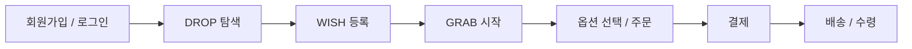

<p align="center">
  
</p>

<h1 align="center">GRAB</h1>

<p align="center">
  기다림은 짧게, 기회는 단 한 번.<br />
  WISH부터 구매와 배송까지 연결하는 한정 판매 DROP 커머스
</p>

<div align="center">
  <table>
    <tr>
      <td align="center" width="160">
        <a href="https://github.com/wlsdn020416">
          
          <br />
          
        </a>
      </td>
      <td align="center" width="160">
        <a href="https://github.com/ImJhoon">
          
          <br />
          
        </a>
      </td>
      <td align="center" width="160">
        <a href="https://github.com/jmin4078">
          
          <br />
          
        </a>
      </td>
      <td align="center" width="160">
        <a href="https://github.com/sang9831">
          
          <br />
          
        </a>
      </td>
    </tr>
  </table>
</div>

<p align="center">
  <a href="./Backend/docs/README.md">프로젝트 문서</a>
  ·
  <a href="./Backend/docs/development/REQUIREMENTS.md">요구사항</a>
  ·
  <a href="./Backend/docs/development/api-spec/README.md">API 명세</a>
  ·
  <a href="./Backend/docs/development/ERD.md">ERD</a>
</p>

## 핵심 포인트

- 정해진 시간에 한정 수량 상품을 판매하는 WISH·GRAB 흐름
- PostgreSQL 트랜잭션과 행 잠금을 통한 주문 생성·재고 선점 정합성 보장
- 멱등 키와 요청 해시를 활용한 주문·결제·배송 중복 처리 방지
- 토스페이먼츠 테스트 환경을 이용한 결제 승인과 결과 불명 상태 보정
- Spring Security, JWT, Redis를 활용한 인증·인가와 토큰 관리
- Docker, GitHub Actions, Actuator, Prometheus 기반의 실행·검증·모니터링 구성

## 사용자 핵심 흐름



## Tech Stack

### Backend


### Frontend


### Infra / External


## 상세 문서

| 문서 | 링크 |
| --- | --- |
| 전체 문서 안내 | [Backend/docs/README.md](./Backend/docs/README.md) |
| 요구사항 정의서 | [Backend/docs/development/REQUIREMENTS.md](./Backend/docs/development/REQUIREMENTS.md) |
| 기술 스택 | [Backend/docs/development/TECHSTACK.md](./Backend/docs/development/TECHSTACK.md) |
| API 명세 | [Backend/docs/development/api-spec/README.md](./Backend/docs/development/api-spec/README.md) |
| ERD | [Backend/docs/development/ERD.md](./Backend/docs/development/ERD.md) |
| 코딩 컨벤션 | [Backend/docs/collaboration/CODING_CONVENTION.md](./Backend/docs/collaboration/CODING_CONVENTION.md) |
| PR 컨벤션 | [Backend/docs/collaboration/PR_CONVENTION.md](./Backend/docs/collaboration/PR_CONVENTION.md) |
| 모니터링 | [Backend/docs/MONITORING.md](./Backend/docs/MONITORING.md) |

## 실행

### Backend

```bash
cd Backend
cp .env.example .env
docker compose up --build
```

### Frontend

```bash
cd Frontend
npm install
npm run dev
```

> Frontend는 현재 Mock 데이터를 사용하는 화면 초안이며 백엔드 API 연동을 진행할 예정입니다.
